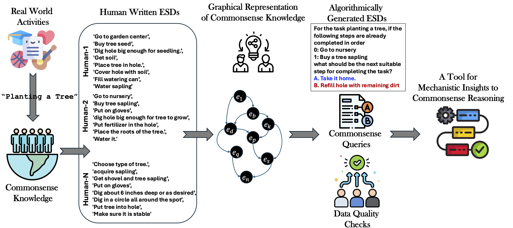

# Towards Quantifying Commonsense Reasoning with Mechanistic Insights

This repository contains the official release of the following paper:
> **Towards Quantifying Commonsense Reasoning with Mechanistic Insights**<br>



**Picture:** *The figure provides an overview of the proposed resource. Real-world activities (well understood by
humans) are considered to capture commonsense knowledge about these activities via human crowdsource workers.
These ESDs are used to create a graphical representation of these activities and the underlying commonsense
knowledge. The graphical representations help create enormous commonsense queries (∼ 10e17 queries per activity).
The created resource of commonsense queries is reverified via data quality checks from humans. The overall
flexibility attained using the graphical representations helps tease apart the reasoning mechanisms of LLMs, creating
a tool for mechanistic insights into commonsense reasoning.*


## Abstract
*Commonsense reasoning deals with the implicit knowledge that is well understood by humans and typically acquired via interactions with the world. In recent times, commonsense reasoning and understanding of various LLMs have been evaluated using text-based tasks. In this work, we argue that a proxy of this understanding can be maintained as a graphical structure that can further help to perform a rigorous evaluation of commonsense reasoning abilities about various real-world activities. We create an annotation scheme for capturing this implicit knowledge in the form of a graphical structure for 37 daily human activities. We find that the created resource can be used to frame an enormous number of commonsense queries (∼ 10e17), facilitating rigorous evaluation of commonsense reasoning in LLMs. Moreover, recently, the remarkable performance of LLMs has raised questions about whether these models are truly capable of reasoning in the wild and, in general, how reasoning occurs inside these models. In this resource paper, we bridge this gap by proposing design mechanisms that facilitate research in a similar direction. Our findings suggest that the reasoning components are localized in LLMs that play a prominent role in decision-making when prompted with a commonsense query.*

## Dataset

The dataset for the 37 scenarios can be found in the [data](./data/) directory. The dataset is created by sampling trajectories from the obtained graph. The dataset is in the form of a CSV file with the following columns:
- `task_step`: The step number in the scenario.
- `task_completion_percentage`: The percentage of the steps that are completed in the list of previous actions when compared to the total number of steps in the trajectory.
- `previous_actions`: The previous actions taken in the scenario.
- `choices`: The choices available to the agent.
- `correct_choice`: The correct choice for the given scenario (textual description of the action).
- `correct_action`: The correct action for the given scenario (true label for the classification task).

## Language Model Evaluation

The directory [lm_predictions](./lm_predictions/) contains the predictions of the different open-weight language models on the generated questions. The consolidated results can be seen using the [consolidate_results.py](./consolidate_results.py) script. 

## Citation


```

@inproceedings{
anonymous2025towards,
title={Towards Quantifying Commonsense Reasoning with Mechanistic Insights},
author={Anonymous},
booktitle={The 2025 Annual Conference of the Nations of the Americas Chapter of the ACL},
year={2025},
url={https://openreview.net/forum?id=tQ95R9kwgP}
}
```

## License

[](https://creativecommons.org/licenses/by-nc/4.0/)
The released dataset follows [CC BY-NC 4.0](https://creativecommons.org/licenses/by-nc/4.0/) license. 

